# Enhancing Imbalanced Classification Performance: Imbalanced XGBoost, Custom Loss Functions, and Combined Approaches

**Author:** Alexander Nemecek

**Affiliation:** Case Western Reserve University

## 1. Survey
### 1.1 A Comparative Analysis of XGBoost (C. Bentejaca, A. Csorgo, G. Martınez-Munozc)
The paper presents a practical use for machine learning models, particularly ensemble models discussing eXtreme Gradient Boosting (XGBoost), gradient boosting and random forests. The study looked to explain the differences between gradient bosting and XGBoost while also incorporating the other decision tree ensemble method, random forests. 

Random forest is an ensemble of decision trees which operates by utilizing bootstrap and attribute sampling. Each decision tree is trained on a random sample with replacement from the original data, resulting in bootstrap samples. During node splitting, attribute sampling selects a subset of inputs to identify the best split. The evaluated parameters used to control the tree's growth, influencing its complexity were `max_depth`, `min_samples_split`, and `min_samples_leaf`. The generalization error converges as the number of trees in the forest increases based on the Strong Law of Large Numbers, making the size of the ensemble less critical as it approaches its error.

Gradient boosting aims to construct an additive approximation by minimizing a loss function iteratively. It involves fitting weak learners (e.g., decision trees) to pseudo-residuals. The parameters assessed were `learning_rate (ν)`, `max_depth`, `subsample`, and `max_features` which control the complexity of the trained models. Regularization parameters such as `learning_rate` for shrinkage and `max_depth` for tree depth restriction help prevent overfitting and ensure effective model training.

XGBoost is a scalable decision tree ensemble based on gradient boosting and controls tree complexity using a different loss function. The model is contained due to the `learning_rate (ν)` parameters and employs `gamma (γ)` for minimum loss reduction. XGBoost also integrates subsampling techniques without replacement and implements advanced methods to enhance training speed. To reduce complexity during the process of finding the best split, XGBoost utilizes a column-based structure to avoid repetitive data sorting and percentile-based techniques for selecting candidate splits efficiently.

The results of the study analyze of the efficiency of random forest, gradient boosting, and XGBoost models. The study uses 28 diverse datasets from the UCI repository, spanning various domains, attributes, instances, and classes. If default setting for the models were not used, then parameters of the models were tuned using a grid search. The comparison involved stratified 10-fold cross-validation. All ensembles comprised 200 decision trees, and the performance evaluation included accuracy, standard deviation, and execution time.

Gradient boosting showed the highest accuracy across some problems however, its advantage over XGBoost and random forest was statistically insignificant in average ranks. The default settings for XGBoost and gradient boosting led to less successful models showing the need of parameter tuning in some instances. Random forest resulted in better average performance using default parameters. XGBoost's parameter grid focusing on specific randomization parameters significantly boosted its accuracy. The exhaustive parameter grid search consumed over 99.9% of computational effort but using a smaller grid notably reduced the tuning time for XGBoost.

### 1.2 Diabetes Prediction Based on XGBoost Algorithm (M. Li, X. Fu, D. Li)
The paper looks at the practical uses machine learning has in industry. The study uses XGBoost to show accurate classifications in the prediction of diabetes using experimental data from the National Institute of Diabetes and Digestive and Kidney Diseases. The XGBoost algorithm is described, trained, and then a comprehensive analysis is conducted.

The XGBoost algorithm optimizes the target function using decision trees and iterative weak classifier calculations. While the paper does not go into great detail regarding the equations presented, the paper describes the best optimal structure of the XGBoost model by $( w^* = -\frac{G_j}{H_j + \lambda})$, where $w^*$ denotes the optimal weight for a specific node, $G_j$ and $H_j$ are the first and second order derivatives respectively (gradient & hessian), and $\lambda$ (lambda) is used as a regularization parameter to prevent overfitting.

Using a standard preprocessing schema, the derived dataset is comprised of more than 768 individuals. The authors wanted to see if the data was processed properly so during correlation analysis, glucose content, body weight, and age's highlighted significance in relation to diabetes. Comparing the model comparisons of Support Vector Machine, K-Nearest Neighbor, Naive Bayes, Decision Tree, Logistic Regressions, and XGBoost, XGBoost had the highest accuracy of 81.2% with the lowest operations of hours, 0.203 hours. Model pairing was also conducted with XGBoost and Logistic Regression and XGBoost paired with data feature switching. All three methods showed around the same metrics (accuracy, recall, F1) but the best results were shown by the model of XGBoost paired with data feature switching.

### 1.3 Imbalance-XGBoost: leveraging weighted and focal losses for binary label-imbalanced classification with XGBoost (C Wanga, C. Denga, S. Wang)
This article was the original source of implementation for this project. The paper presents a new algorithm called Imbalanced-XGBoost involving customized loss functions with respect to weighted and focal losses to handle binary label-imbalanced classifications.

The code design of the package uses Python and XGBoost's library built in `train()` as a base with the new implementation involving three main classes `imbalance_xgboost`,  `Weight_Binry_Cross_Entropy`, and `Focal_Binary_Loss`. 

One of the novel loss functions presented is the weighted cross-entropy loss class denoted as:

$$
\begin{aligned}
L_w = -\sum_{i=1}^{m} \left( \alpha y_i \log(\hat{y}_i) + (1 - y_i) \log(1 - \hat{y}_i) \right)
\end{aligned}
$$

with $\alpha$ indicating the imbalance parameter or "weighted alpha". If greater than 1, the extra loss will be counted on classifying a '1' as a '0', and if less than 1, vice versa. The first order derivative or gradient, returned by the class is denoted as:

$$
\begin{aligned}
\frac{\partial L_w}{\partial z_i} = -\alpha y_i (y_i - \hat{y}_i)
\end{aligned}
$$

While the second order derivative (hessian) returned by the class is denoted as:

$$
\begin{aligned}
\frac{\partial L^2_w}{\partial z^2_i} = -\alpha y_i (y_i - \hat{y}_i)
\end{aligned}
$$

The second loss function presented is called the focal loss function. The `Focal_Binary_Loss` class houses the calculation with the binary focal loss denoted as:

$$
\begin{aligned}
L_f = -\sum_{i=1}^{m} y_i(1 - \hat{y}_i)^\gamma \log(\hat{y}_i) + (1 - y_i)\hat{y}_i^\gamma \log(1 - \hat{y}_i)
\end{aligned}
$$

where setting $\gamma = 0$ allows the function to become an ordinary cross-entropy loss function. The first order derivative of the function is denoted as:

$$
\begin{aligned}
\frac{\partial L_f}{\partial z_i} = \gamma \left[ ( \hat{y}_i + y_i - 1 ) \left( y_i + (-1)^{y_i} \hat{y}_i \right)^\gamma \log(1 - y_i - (-1)^{y_i} \hat{y}_i) \right] + (-1)^{y_i} \left( y_i + (-1)^{y_i} \hat{y}_i \right)^{\gamma + 1}
\end{aligned}
$$

To understand the first and second order derivatives better, the authors use short-hand variables for better readability.

$$
\begin{aligned}
\eta_1 = \hat{y}_i (1 - \hat{y}_i) \\
\eta_2 = y_i + (-1)^{y_i} \hat{y}_i \\
\eta_3 = \hat{y}_i + y_i - 1 \\
\eta_4 = 1 - y_i - (-1)^{y_i} \hat{y}_i
\end{aligned}
$$

The first order derivative is shown as:

$$
\begin{aligned}
\frac{\partial L_f}{\partial z_i} = \gamma \eta_3 \eta^{\gamma}_2 \log(\eta_4) + (-1)^{y_i} \eta^{\gamma+1}_2
\end{aligned}
$$

With respect to $z_i$, the second order derivative is denoted as:

$$
\begin{aligned}
\frac{\partial^2 L_f}{\partial z_i^2} = \eta_1 (\gamma (\eta^\gamma_2 + \gamma(-1)^{y_i}\eta_3\eta^{\gamma-1}_2)\log(\eta_4) - (-1)^{y_i}\eta_3\eta_2^\gamma /n_4  + (\gamma+1)\eta_2^\gamma)
\end{aligned}
$$

An empirical study comparing the results of the weighted and focal loss functions against basic XGBoost is conducted. Using the Parkinson's Disease(PD) classification data with 757 features, there was a small decline when using the weighted and focal loss function when comparing against pure XGBoost, however the $F_1$ showed significantly better results. Even though the loss functions did not increase the accuracy of the model, some results indicated a high accuracy and a low $F_1$ score, meaning the classifiers were not able to tell the difference classes. The high accuracy is most likely due to the increased prediction of the majority class.

### 1.4 XGBoost: A Scalable Tree Boosting System (T. Chen, C. Guestrin)
The paper presents XGBoost, an end-to-end tree boosting system known for scalability and efficiency in handling tree ensemble models. It employs a set of algorithms and optimizations to accommodate sparse data and accelerate learning processes through parallel and distributed computing. XGBoost's scalability stems from various optimizations, including novel tree learning algorithms for handling sparse data. It utilizes weighted quantile sketches and parallel/distributed computing techniques to increase model time and results.

The core of XGBoost is in its ensemble of trees, using additive functions across K trees to predict output. This model minimizes a regularized objective function, balancing convex loss functions, complexity penalties, and regularization terms to prevent overfitting. The system adopts an additive training approach to minimize the objective function iteratively, aiming to improve the model at each step.

The literature presents techniques such as shrinkage and column subsampling as to mitigate overfitting risks, like methodologies used in Random Forest models. XGBoost proposes candidate splitting points based on feature distribution percentiles. The algorithm offers both global and local variants for split proposals, contributing to efficient tree construction. To handle sparsity in data, XGBoost introduces default directions in tree nodes. The algorithm's design allows computation complexity to be linearly related to the number of non-missing entries in the input data.

The data being used within the model is organized into in-memory units called blocks, stored in a compressed column format. XGBoost's approach reduces sorting costs and enables parallelism in split finding. XGBoost also optimizes disk reading throughput by employing block compression and block shading techniques, so data does not exceed main memory capacity. The system's time complexity analysis demonstrates significant reductions, leading to improved computational efficiency. XGBoost incorporates cache-aware optimizations to mitigate cache misses and inefficiencies in tree learning algorithms. It also maximizes machine resources, including disk space, for scalable learning and efficient utilization of available resources.

The literature created an empirical study on four different datasets: Allstate, Higgs Boson, Yahoo LTRC, Criteo. The evaluations of XGBoost's performance were done using its greedy algorithm and comparing it to other greedy tree boosting algorithms. The pseudocode for XGBoost's greedy algorithms is described below:
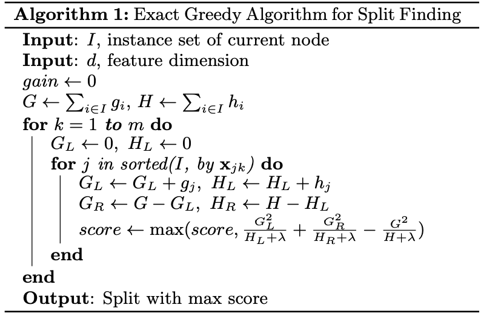
Other experiments were conducted including an out-of-core experiment tailoring to the system in the out-of-core context and a distributed experiment which evaluated the system in a distributed setting.

### 1.5 Training Deep Neural Networks on Imbalanced Data Sets (S. Wang, W. Liu, J. Wu, L. Cao, Q. Meng, P. Kennedy)
This paper addresses the issue of imbalanced datasets in deep neural networks for classification tasks. The paper introduces innovative loss functions, mean false error (MFE), and mean squared false error (MSFE), tailored for training deep neural networks (DNN) on imbalanced datasets by equally considering errors from both majority and minority classes. The proposed loss functions aim to mitigate the bias towards the majority class which is commonly observed in the mean squared error (MSE) loss function and tries to enhance classification accuracy in imbalanced datasets.

The paper provides a detailed review of approaches to handle imbalances in classification such as categorizing them into sampling techniques, cost-sensitive learning, and their application within neural networks. Due to the lack of literature addressing imbalance classification, S. Wang, etc. formulates the problem and introduces MFE and MSFE as solutions, delineating their computation, impact on back-propagation, and advantages over MSE.

Even though classification imbalances are a problem, DNNs can learn from imbalanced and high-dimensional datasets, emphasizing their feature extraction capabilities. This outlines the parameters influencing network structure and the heuristic approach employed to identify optimal architectures. However, a commonly used function is MSE loss which emphasizes minimizing squared errors but tends to favor the majority class, impacting performance on minority class instances in imbalanced datasets.

MSE is a commonly used loss function in regression problems and is also applied to classification tasks in neural networks. The function measures the average of the squared differences between predicted values and actual values across all data points. The MSE loss function can be represented as:

$$
\begin{aligned}
l = \frac{1}{M}\sum_{i}\sum_{n}\frac{1}{2}(d^{(i)}_n-y^{(i)}_n)^2
\end{aligned}
$$

Mean False Error (MFE) is a proposed alternative loss function in order to address imbalanced datasets effectively in DNNs. MFE aims to equally consider errors from both majority and minority classes. It calculates the average of the false errors, which are the absolute differences between the predicted values and the actual values, regardless of the squared nature. The MFE loss function for can be denoted as with FPE as "False Positive Error" and FNE as "False Negative Error":

$$
\begin{aligned}
FPE = \frac{1}{N}\sum_{i=1}^N\sum_{n}\frac{1}{2}(d^{(i)}_n-y^{(i)}_n)^2
\end{aligned}
$$

$$
\begin{aligned}
FNE = \frac{1}{P}\sum_{i=1}^P\sum_{n}\frac{1}{2}(d^{(i)}_n-y^{(i)}_n)^2
\end{aligned}
$$

$$
\begin{aligned}
l'=FPE+FNE
\end{aligned}
$$

Mean Squared False Error (MSFE) is an extension of the MFE loss, which aims to retain the benefits of MFE while preserving the squared error formulation. The extension computes the average of squared false errors between predicted values and actual values, maintaining the consideration of errors from both majority and minority classes. The MSFE loss function can be dented as:

$$
\begin{aligned}
l''=FPE^2+FNE^2=\frac{1}{2}((FPE+FNE)^2 + (FPE-FNE)^2)
\end{aligned}
$$

The experimental setup evaluates MFE and MSFE on many imbalanced datasets, showing the increase or equivalent performance compared to MSE, particularly in highly imbalanced scenarios. The observations validate the theoretical analyses, issuing stability and consistent improvements of MFE and MSFE over MSE. Example of results shown below for document datasets:
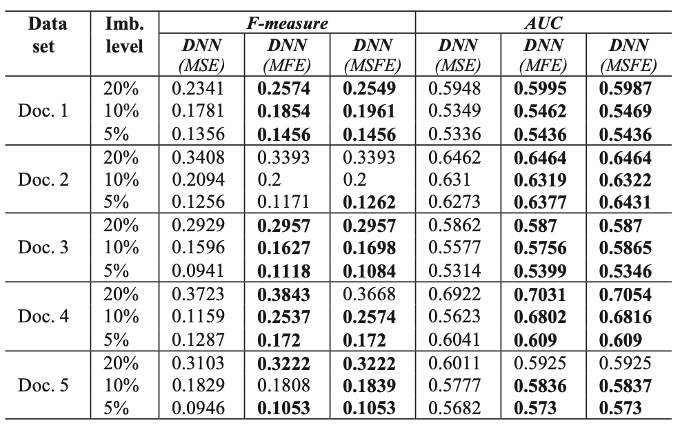

### 1.6 An efficient XGBoost–DNN-based classification model for network intrusion detection system (P. Devan, N. Khare)
The literature proposes a XGBoost-DNN hybrid model for network intrusion detection. The hope is to overcome limitations faced by traditional shallow machine learning techniques, such as SVM, logistic regression, and Naive Bayes, which are computationally expensive, and can be error prone. This approach integrates the strengths of XGBoost for effective feature selection and a Deep Neural Network (DNN) for intricate pattern recognition and classification.

The proposed model has three steps, first, data normalization to ensure consistent scaling across features and facilitating an optimal design. Next, using XGBoost technique's feature importance score helps with the challenges posed by high dimensionality which reduces features that might lead to overfitting in the subsequent DNN phase. The prediction of the XGBoost can be denoted as:

$$
\begin{aligned}
y_i'=\sum_{m=1}^mf_k
\end{aligned}
$$

with $m$ being the number of decision trees in the ensemble and $f_k$ being the prediction of the decision tree. The optimization of the algorithm’s loss function is also paramount, the loss function used is represented as:

$$
\begin{aligned}
L=-\frac{1}{N}\sum_{i}^N((y_i\log(p_i))+(1-y_i)\log(1-p_i))
\end{aligned}
$$

The regularization of the XGBoost is important to define the objective of the model. The following is the regularization followed by the objective of the XGBoost model.

$$
\begin{aligned}
\Omega=\Upsilon^T+\frac{1}{2}\lambda\sum(w_{j^2})
\end{aligned}
$$

$$
\begin{aligned}
obj = L+\Omega
\end{aligned}
$$

The output of the XGBoost model is then fed into the DNN classifier as inputs, where the model is trained to identify network intrusions as the final step. An overview of the proposed model can be depicted below:
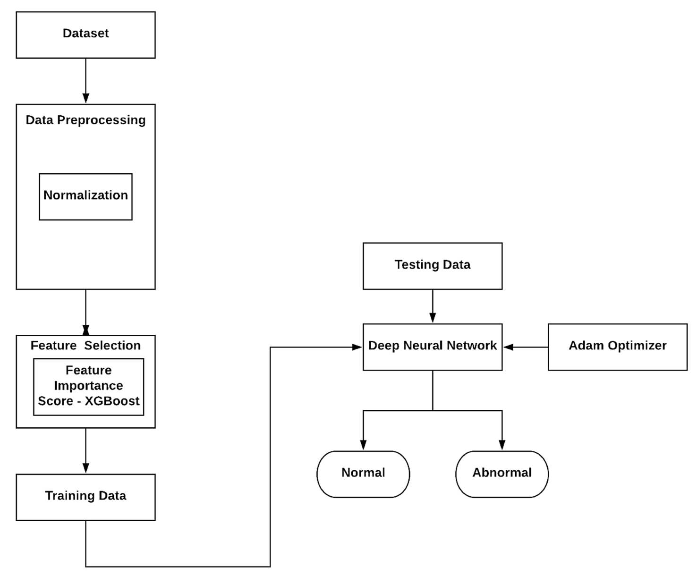

The model also makes use of the Adam optimizer function during the DNN training phase which enhances the learning rate optimization. On the other hand, the softmax classifier aids in efficiently categorizing network intrusions. The performance of this model is evaluated using the following metrics: accuracy, precision, recall, and F1-score. As seen by the comparative analysis of the metrics between the XGBoost-DNN and other machine learning algorithms, the model shows itself to be beneficial.
- Accuracy: 

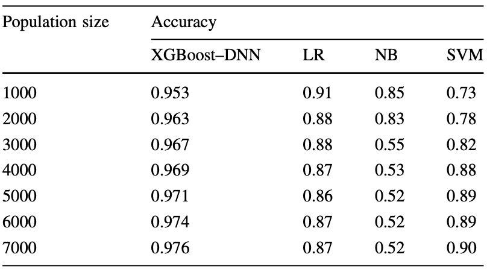
- Precision: 

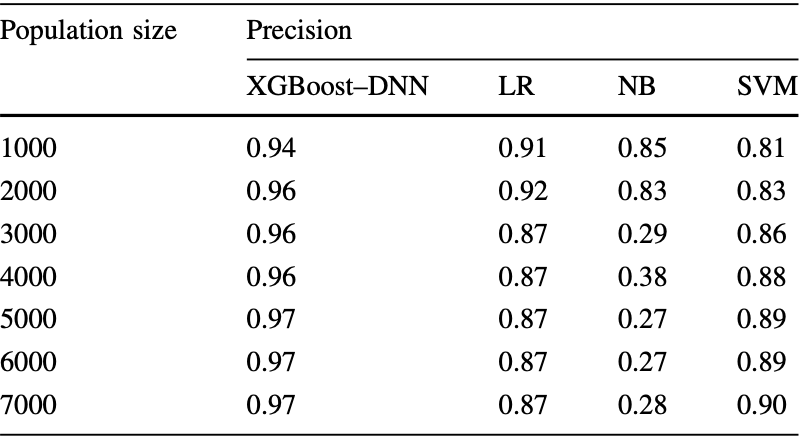
- Recall: 

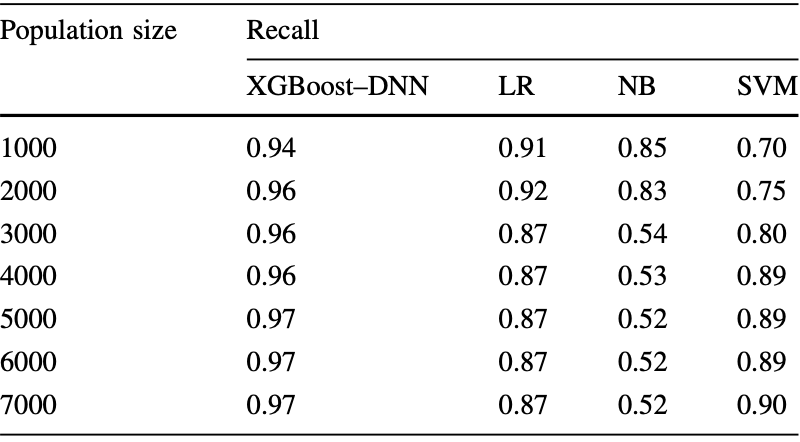
- $F_1$-score: 

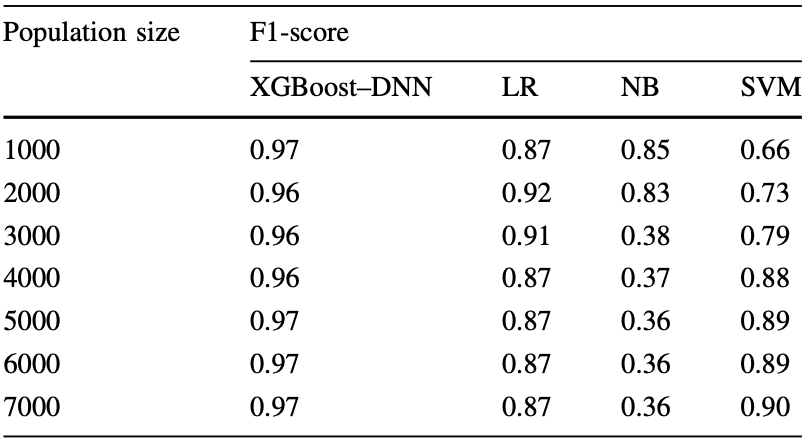

As seen in the figures above, the validation process involves K-fold cross-validation on the NSL-KDD dataset, exploring different population sizes. Notably regarding accuracy, as the model's population size increases, the accuracy of the model does as well with a population size of 7000, the model achieves an accuracy of 97%.

Overall, the XGBoost-DNN hybrid model showcases significant promise in the realm of network intrusion detection. Its successful application in binary classification underscores its potential for broader application, potentially extending into multiclass classification scenarios in the future. This pioneering approach not only outperforms existing models but also presents a scalable and efficient solution for detecting and classifying network intrusions.


## 2. Methods 
#### 2.1 Imbalanced XGBoost Implementation
As mentioned in section "1.3 Imbalance-XGBoost: leveraging weighted and focal losses for binary label-imbalanced classification with XGBoost" my implementation was followed by the paper’s instructions and diagram:


The main structure of the implementation consisted of three files `imbalancedXGBoost.py`, `weightedBinaryCrossEntropy.py`, and `focalBinaryLoss.py` each with their own respective class.

`imbalancedXGBoost.py` housed the class `ImbalancedXGBoost` and took in parameters: [n_estimators, max_depth, max_leaves, eta_learning_rate, verbosity, objective, booster, gamma, min_child_weight, early_stopping_rounds, eval_metric, l1_reg_alpha, l2_reg_lambda, focal_gamma, and weighted_alpha]. The class involved `fit` and `predict` functions. The `fit` function was responsible for passing in X and y, splitting the datasets, converting them into matrices used by XGBoost (DMatrix) and then depending on the `objective` parameter, the respective loss function (focal, weighted, or default) was called and passed in using XGBoost's `train` method. The `predict` function is simple in terms of using the library's `predict` method. Both X and y testing parameters were passed in and had to be converted to matrices that the XGBoost algorithm could run. The function returns a list of predictions which is then used to calculate accuracy.

In the `ImbalancedXGBoost` class's `fit` function, there is an implemented condition depending on the user specified objective function to use. If "weighted", then the `WeightedBinaryCrossEntropy` and if the parameter is "focal" then `FocalBinaryLoss` both with their respective values needed, `weighted_alpha` for `WeightedBinaryCrossEntropy` and `focal_gamma` for `FocalBinaryLoss`.

`weightedBinaryCrossEntropy.py` housed the class `WeightedBinaryCrossEntropy`. The class has one global variable tailor to the loss function, `weighted_alpha`. The class also only has one function that is used to calculate the first and second order derivatives based on the passe in variables `pred` and `dtrain` (`dtrain` is the training data passed through XGBoost's `DMatrix` function).

The first order derivative (gradient) as seen prior returned by `WeightedBinaryCrossEntropy` is denoted as:

$$
\begin{aligned}
\frac{\partial L_w}{\partial z_i} = -\alpha y_i (y_i - \hat{y}_i)
\end{aligned}
$$

with the code counterpart calculated as:

```
sigmoid = 1 / (1 + np.exp(-pred))
residual = dtrain.get_label() - sigmoid

gradient = -(weighted_alpha ** dtrain.get_label()) * residual
```

The second order derivative (hessian) returned by the class is denoted as:

$$
\begin{aligned}
\frac{\partial L^2_w}{\partial z^2_i} = -\alpha y_i (y_i - \hat{y}_i)
\end{aligned}
$$

with the code counterpart as:

```
hessian = (weighted_alpha ** dtrain.get_label()) * (1 - sigmoid) * sigmoid
```

The function then returns the gradient and hessian as two separate values.

The `focalBinaryLoss.py` is similar where it houses only the `FocalBinaryLoss` class with the respective value, `focal_gamma`, and function. Using step-by-step what C. Wang, C Deng, and S. Wang (Imbalance-XGBoost: leveraging weighted and focal losses for binary label-imbalanced classification with XGBoost) calculated in the paper, they used short-hand variable as to not over complicate the derivatives and code. The following show the mathematical calculations and the implemented code representing them.

Short-hand variables:

$$
\begin{aligned}
\eta_1 = \hat{y}_i (1 - \hat{y}_i) \\
\eta_2 = y_i + (-1)^{y_i} \hat{y}_i \\
\eta_3 = \hat{y}_i + y_i - 1 \\
\eta_4 = 1 - y_i - (-1)^{y_i} \hat{y}_i
\end{aligned}
$$

```
sigmoid = 1 / (1 + np.exp(-pred))

n_1 = sigmoid * (1 - sigmoid)
n_2 = dtrain.get_label() + ((-1) ** dtrain.get_label()) * sigmoid 
n_3 = sigmoid + dtrain.get_label() - 1
n_4 = 1 - dtrain.get_label() - ((-1) ** dtrain.get_label()) * sigmoid 
```

The first order derivative:

$$
\begin{aligned}
\frac{\partial L_f}{\partial z_i} = \gamma \eta_3 \eta^{\gamma}_2 \log(\eta_4) + (-1)^{y_i} \eta^{\gamma+1}_2
\end{aligned}
$$

```
gradient = focal_gamma * n_3 * (n_2 ** focal_gamma) * np.log(n_4 + 1e-9) + ((-1) ** dtrain.get_label()) * (n_2 ** (focal_gamma + 1))
```

The second-order derivative:

$$
\begin{aligned}
\frac{\partial^2 L_f}{\partial z_i^2} = \eta_1 (\gamma (\eta^\gamma_2 + \gamma(-1)^{y_i}\eta_3\eta^{\gamma-1}_2)\log(\eta_4) - (-1)^{y_i}\eta_3\eta_2^\gamma /n_4  + (\gamma+1)\eta_2^\gamma)
\end{aligned}
$$

```
hessian = n_1 * ( focal_gamma * ( ( ((n_2 ** focal_gamma) + focal_gamma * ((-1) ** dtrain.get_label()) * n_3 * (n_2 ** (focal_gamma-1))) * np.log(n_4) ) - ( ( ((-1) ** dtrain.get_label()) * n_3 * (n_2 ** focal_gamma) ) / n_4 ) ) + ((focal_gamma + 1) * (n_2 ** focal_gamma)) )
```

The usability of this algorithm relies in the consolidation of all models using the `main.py` script allowing for user input in the command line. Instructions on how to run the code is documented in the README.md.

#### 2.2 Deep Neural Network with Custom Loss Function
With the loss functions being implemented against XGBoost with base model as decision trees, the implementation of the loss function calculations is used for a deep neural network (DNN).
The DNN is denoted using the script `deepNerualNetwork.py`. The script consists of one class, `ImbalancedDeepNeuralNetwork`, which uses the parameters as follows: [epochs, batch_size, input_layer, input_layer_activation, hidden_layer, hidden_layer_activation, output_layer, output_layer_activation, optimizer, loss, focal_gamma, weighted_alpha, metrics]. The class consists of six functions listed below:

- `focalLoss`: Same methodolody where the gradient and hessian is calculated with the `focal_gamma` variable.
- `weightedCrossEntropyLoss`: Same methodolody where the gradient and hessian is calculated with the `weighted_alpha` variable.
- `focalLossFunct`: Call the `focalLoss` to feed the gradient and hessian calculations into TensorFlow’s `square` and `reduce_mean` functions as displayed below:
    ```
    gradient, hessian = self.focalLoss(predictions, float(labels))
    return tf.reduce_mean(tf.square(gradient / (hessian + 1e-9)))
    ```
- `weightedLossFunct`: Call the `weightedCrossEntropyLoss` to feed the gradient and hessian calculations into TensorFlow’s `square` and `reduce_mean`. The same as `focalLossFunct` but for the weighted cross-entropy loss.
- `predict`: Takes an X dataset (usually testing) and using the defined model's `predict` function to return a set of predictions.
- `compile_fit`: Defines, compiles, fits, and returns the DNN model. The model is first defined using TensorFlow’s Kera’s model. The DNN is comprised of one input layer, one hidden layer, and one output layer. These variables can be changed if the function is accessed directly, but how `main.py` is set up, a user cannot change them from the CLI. The default vales for the input layer are 12 nodes and a ReLu activation function, 8 nodes and ReLu activation for the hidden layer, and 1 node and Sigmoid activation function for the output layer. Our studies primarily focus on binary classification hence the one node in the output layer. Once defined, the function will check, like `ImbalancedXGBoost`, for the specified loss function and then compile the model based on it. If it is "weighted" then the weighted loss function is called, if "focal" then the focal loss function is called, if nothing is specified, then the DNN will use the default value. Finally, the model is fit with the number of epochs and batch_size and is returned from the function.

(NOTE: This implantation was not due to one specific paper but rather an inspiration for research extensions.)

#### 2.3 Stacked Model: Combined DNN and XGBoost 
With the implementations of DNN and XGBoost and both tailored to correcting for imbalanced classification data, the `imbalancedDNNBoost.py` script, like the others, houses one class, `ImbalancedDNNBoost`. The class allows for the parameters of the following: [epochs, dnn_loss, dnn_weighted_alpha, dnn_focal_gamma, xgb_loss, xgb_weighted_alpha, xgb_focal_gamma]. The class uses one method, `combo`, which takes in all subsets of the original dataset, `X_train`, ` X_test`, `y_train`, and `y_test`. The function checks for both the DNN and XGBoost loss function, equally a total of 9 different combinations of loss functions regarding, weighted loss, focal loss, and default.

The DNN model is first compiled and fit using the specified loss function. The model uses its built in `predict` functions to split the prediction data into a training and testing predictions (example shown below):
```
dnn_model_predictons_train = dnn_model.predict(X_train)
dnn_model_predictons_test = dnn_model.predict(X_test)
```
These predictions are used in concatenation with the `X_train` and `X_test` data subsets as to create an extended dataset with the predictions of the DNN being input for the XGBoost model.

The function checks the specified loss function for the XGBoost model implementation and then the chosen model is fit using the `ImbalancedXGBoost` class's `fit` function. The model can then be used to get predictions leading to an accuracy score for the combined model schema.

The overall steps of the combination procedure of models are expressed below:


(NOTE: This implantation was not due to one specific paper but rather an inspiration for research extensions.)


## 3. Research 
### 3.1 Imbalanced XGBoost Implementation Comparison ###

#### Objective: ####
- Compare the performance of a customized, from-scratch, implementation of the Imbalanced XGBoost algorithm against the standard library implementation to assess any differences or improvements.

#### Methodology: ####
- **Setup**: Utilization of the same dataset for both library and “from-scratch” implementations.
- **Custom Implementation**: Detailed customized Imbalanced XGBoost implementation includes two custom loss functions, weighted cross-entropy loss and focal loss, which will be compared to the XGBoost library on both balanced and imbalanced datasets due to the functions purpose is to handle imbalanced data.
- **Standard Library Implementation**: Implementation of the standard setup for using the XGBoost library without any customizations other than a specified number of training rounds.
- **Evaluation Metrics**: Accuracy will be chosen as the main evaluation metric as it is not present in the main implementation paper of Imbalanced XGBoost.

### 3.2 Deep Neural Network with Customized Loss Functions ###

#### Objective: ####
- Assess the effectiveness of a deep neural network utilizing customized loss functions compared to the Imbalanced XGBoost implementation.

#### Methodology: ####
- **Neural Network Architecture**: The architecture of the neural network is composed of one input layer with 12 nodes with the activation function being ReLu, one hidden layer with 8 nodes and the activation function again, being ReLu, and finally the output layer is made up of 1 node since the focus is binary classification. Due to this architecture, the network is labeled as “deep” making it a deep neural network (DNN).
- **Customized Loss Functions**: Using the same loss functions created for Imbalanced XGBoost, we want to take the return values from the respective function called, fix the gradient and hessian to a scalar value, and then use this as the loss function for a DNN.
- **Training Strategy**: All DNN's trained will have the same epoch value of 100 and the differentiating factor being the customized loss function and function’s respective values (`weighted_alpha` & `focal_gamma`).
- **Evaluation Metrics**: Accuracy will be chosen as the main evaluation metric to determine the most accurate DNN.

### 3.3 Combination of XGBoost and Deep Neural Network Models: Imbalanced DNN-Boost ###

#### Objective: ####
- Explore the benefits of combining XGBoost and DNN models by using the output of one as input to the other as well as exploring the combination of different customized loss functions.

#### Methodology: ####
- **Ensemble Approach**: Through the implementation of Imbalanced XGBoost’s custom loss function to combat imbalanced dataset, we looked to DNN’s to see if the accuracy metric would have affect depending on the model and the model using the weighted cross-entropy or focal loss function. With the integration of both models into one, the hypothesis is that if one model does not too well in terms of accuracy, the next/prior model will have some say in the overall metric and the classification of imbalanced binary data.
- **Nine Custom Loss Function**: Both the Imbalanced XGBoost model and the Imbalanced DNN were able to take in 3 parameters regarding the loss function: “weighted”, “focal” or “default”. With the combination of the two model, this allows for nine possible combinations of loss functions and model types. 
- **Training and Evaluation**: The training process begins with the DNN as a regular training process would. After the DNN is fit, we gather predictions from the model and then concatenate them to the original X_train dataset and feed it into the next model, XGBoost. This allows for the output of the DNN to become the input for the XGBoost model.
- **Evaluation Metrics**: The chosen metric will be accuracy to stay uniform across all models and experimentation to compare different loss functions versus one another and against other model performance.

## 4. Results, Analysis and Discussion ##
### 4.1 Imbalanced XGBoost Implementation Comparison ###
- **Experiment Description**: Compare the performance of a customized, from-scratch, implementation of the Imbalanced XGBoost algorithm against the standard library implementation to assess any differences or improvements.
    - **Datasets Used**:
        - Heart Failure Prediction: https://www.kaggle.com/datasets/fedesoriano/heart-failure-prediction
        - Pima Indians Diabetes: https://github.com/npradaschnor/Pima-Indians-Diabetes-Dataset
        - Sonar Mines: https://github.com/ksatola/Sonar-Mines-vs-Rocks/tree/master
        - Parkinson: https://archive.ics.uci.edu/dataset/174/parkinsons
    -**Parameters**: Both the library XGBoost model and the implemented XGBoost model are being fed the `n_estimators` parameter to specify the number of boosting rounds. Two out of the four models evaluated for each of the datasets have two extra parameters. The model using the weighted loss function will have the parameters `weighted_alpa=0.4` and `objective='weighted'`. The other model using the focal loss function will have the parameters `focal_gamma=1.5` and `objective='focal'`.
    -**Evaluation Metrics**: The metric being used to assess the performance of each model on their respective dataset will be accuracy.

- **Results Per Dataset**:
    - Heart Failure Prediction

        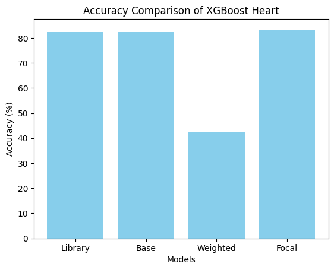

        | Model |  Accuracy (%) |
        | ------|---------------|
        | Library XGBoost | 82.26 |
        | Basic Implemented XGBoost | 82.26 |
        | Weighted Implemented XGBoost | 42.47 |
        | Focal Implemented XGBoost | 83.33 |

    - Sonar Mines

        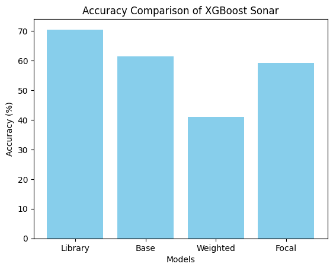

        | Model |  Accuracy (%) |
        | ------|---------------|
        | Library XGBoost | 70.45 |
        | Basic Implemented XGBoost | 61.36 |
        | Weighted Implemented XGBoost | 40.91 |
        | Focal Implemented XGBoost | 59.09 |

    - Pima Indians Diabetes

        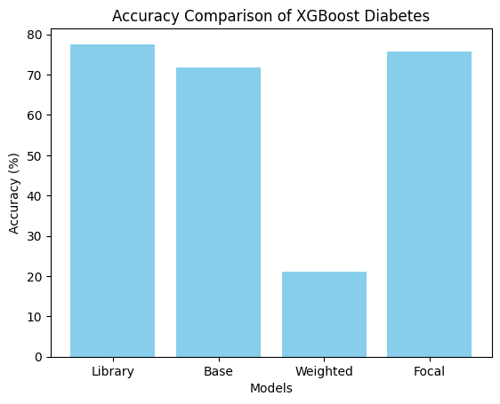

        | Model |  Accuracy (%) |
        | ------|---------------|
        | Library XGBoost | 77.56 |
        | Basic Implemented XGBoost | 71.79 |
        | Weighted Implemented XGBoost | 21.15 |
        | Focal Implemented XGBoost | 75.64 |

    - Parkinson

        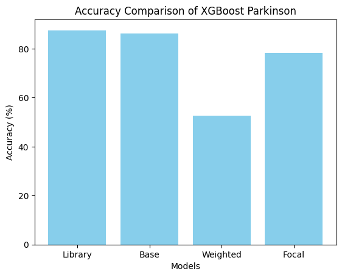

        | Model |  Accuracy (%) |
        | ------|---------------|
        | Library XGBoost | 87.50 |
        | Basic Implemented XGBoost | 86.18 |
        | Weighted Implemented XGBoost | 52.63 |
        | Focal Implemented XGBoost | 78.29 |

- **Analysis & Discussion**: 
Regarding the library implementation and the "from-scratch" implementation of vanilla XGBoost, the farthest distance in accuracy between the two implementations was in the Sonar Mines dataset with ~9% difference in accuracy. All other datasets, balanced or not, concerning the vanilla implementations of XGBoost did not reach a threshed of a 6% difference in the accuracy metric. The XGBoost model with the focal loss function always outperformed the model with the weighted loss function. The weighted loss function had substantially less accuracy for all four datasets against all other models and their respective loss functions. The focal loss function was not far off the vanilla XGBoost implementations even beating both in accuracy by 1% in the Heart Failure Prediction dataset. Looking at the distributions of each of the dataset labels:
- Parkinson:
    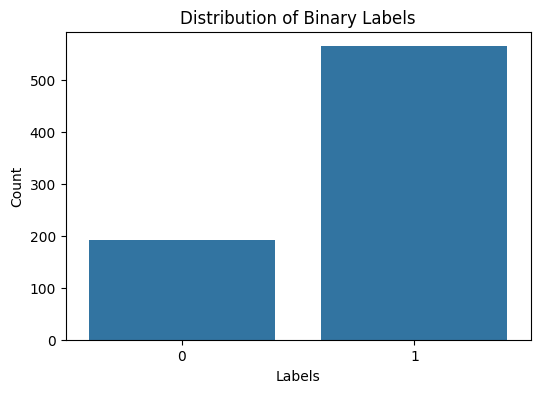
- Heart Failure:
    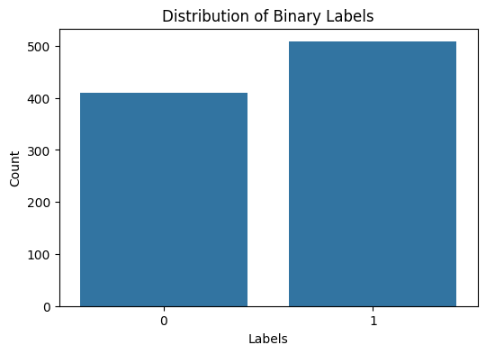
- Sonar Mines:
    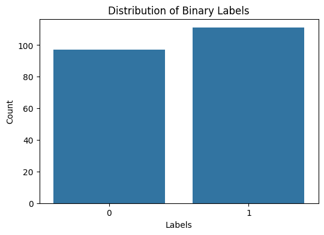
- Pima Diabetes:
    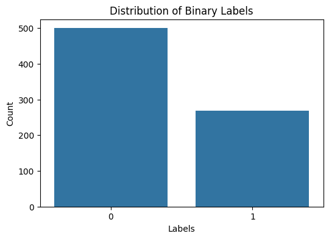

Parkinson and Pima Diabetes datasets show the biggest imbalanced in labels compared to the other two datasets. The focal loss function XGBoost did to relatively well on the imbalanced datasets, however it did the best on the Heart Disease dataset which is not as imbalanced as others. The values of `focal_gamma` and `weighted_alpha` stayed stagnant throughout the training of each of the models. Even though the focal and weighted XGBoost models did worse overall on most of the datasets, it would still be important and worthwhile to be able to look into the specific values associated with the `focal_gamma` and `weighted_alpha` for their respective function to see if the accuracy would change for the better or worse. According to the implementation of imbalanced XGBoost, the models with the loss functions did not perform how they were supposed to with the accuracies of the model's being less than that of their vanilla counterparts.

### 4.2 Deep Neural Network with Customized Loss Functions ###
- **Experiment Description**: Assess the effectiveness of a deep neural network utilizing customized loss functions compared to the Imbalanced XGBoost implementation.
    - **Datasets Used**:
        - Heart Failure Prediction: https://www.kaggle.com/datasets/fedesoriano/heart-failure-prediction
        - Pima Indians Diabetes: https://github.com/npradaschnor/Pima-Indians-Diabetes-Dataset
        - Sonar Mines: https://github.com/ksatola/Sonar-Mines-vs-Rocks/tree/master
        - Parkinson: https://archive.ics.uci.edu/dataset/174/parkinsons
    -**Architecture**: The architecture of the neural network is composed of one input layer with 12 nodes with the activation function being ReLu, one hidden layer with 8 nodes and the activation function again, being ReLu, and finally the output layer is made up of 1 node since the focus is binary classification. Due to this architecture, the network is labeled as “deep” making it a deep neural network (DNN).
    -**Parameters**: All DNN models are being fed the `epochs` parameter to specify the number of rounds equaling 100 epochs. Two out of the three models evaluated for each of the datasets have two extra parameters. The model using the weighted loss function will have the parameters `weighted_alpa=0.4` and `loss='weighted'`. The other model using the focal loss function will have the parameters `focal_gamma=1.5` and `loss='focal'`.
    -**Evaluation Metrics**: The metric being used to assess the performance of each model on their respective dataset will be accuracy.

- **Results Per Dataset**:
    - Heart Failure Prediction
        | Model |  Accuracy (%) |
        | ------|---------------|
        | Basic Implemented DNN | 73.36 |
        | Weighted Implemented DNN | 55.87 |
        | Focal Implemented DNN | 57.92 |

    - Sonar Mines
        | Model |  Accuracy (%) |
        | ------|---------------|
        | Basic Implemented DNN | 85.98 |
        | Weighted Implemented DNN | 48.78 |
        | Focal Implemented DNN | 48.78 |

    - Pima Indians Diabetes
        | Model |  Accuracy (%) |
        | ------|---------------|
        | Basic Implemented DNN | 69.61 |
        | Weighted Implemented DNN | 65.36 |
        | Focal Implemented DNN | 65.36 |

    - Parkinson
        | Model |  Accuracy (%) |
        | ------|---------------|
        | Basic Implemented DNN | 100 |
        | Weighted Implemented DNN | 100 |
        | Focal Implemented DNN | 0.00 |

- **Analysis & Discussion**: 
As shown by the tables above the basic implementation of a deep neural network (DNN) always outperformed the DNN with the customized loss functions. In the relatively equal labeled datasets, heart failure and sonar mines, the basic DNN outperformed both custom models by a margin of more than 10%, with the sonar mine dataset resulting in almost 2x that of the custom DNNs. With one of the imbalanced datasets, Parkinson, there is 100% accuracy for the basic and weighted DNN implementations while the focal DNN results in an accuracy of 0%. A 0% accuracy shows that the classifier is always predicting the wrong label, while on the other hand the basic and weighted DNN classifiers have an accuracy of 100% meaning that the classifier always predicts the correct label. This could be inaccurate for multiple reasons. We saw that the focal and weighted loss functions did not handle the imbalanced dataset the way we impacted in the XGBoost classifiers. The way the loss functions are being used int eh DNN is also another reason as to why we could be experiencing these types of accuracies. Finally, if the loss functions did not handle imbalanced data correctly in the XGBoost classifiers, we could partly expect them to do the same when using another model. As mentioned before, we may be able to investigate changing the `focal_gamma` and `weighted_alpha` values to see if they result in a change or better accuracies for the DNN's with customized loss functions.

### 4.3 Combination of XGBoost and Deep Neural Network Models: Imbalanced DNN-Boost ###
- **Experiment Description**: 
    - **Datasets Used**:
        - Heart Failure Prediction: https://www.kaggle.com/datasets/fedesoriano/heart-failure-prediction
        - Pima Indians Diabetes: https://github.com/npradaschnor/Pima-Indians-Diabetes-Dataset
        - Sonar Mines: https://github.com/ksatola/Sonar-Mines-vs-Rocks/tree/master
        - Parkinson: https://archive.ics.uci.edu/dataset/174/parkinsons
    -**Parameters**: All DNN models will have the `epochs` equal to 100 to specify the number of training rounds. The DNN model can be given the `loss='weighted'`, `loss='focal'`, or no parameter. If the model has one of the customized loss functions, then they will have the respective input parameter, `weighted_alpa=0.4` or `focal_gamma=1.5`. The implemented XGBoost model will have the `n_estimators` parameter as 10 to specify the number of boosting rounds. The XGBoost model can use the weighted loss function which will have the parameters `weighted_alpa=0.4` and `objective='weighted'`. The other option is the XGBoost model uses the focal loss function which will have the parameters `focal_gamma=1.5` and `objective='focal'`.
    -**Evaluation Metrics**: The metric being used to assess the performance of each model on their respective dataset will be accuracy.

- **Results**:
    - Heart Failure Prediction

        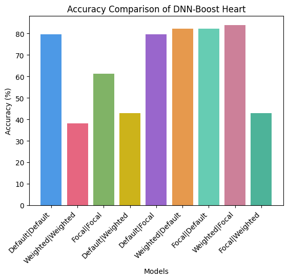

    - Sonar Mines

        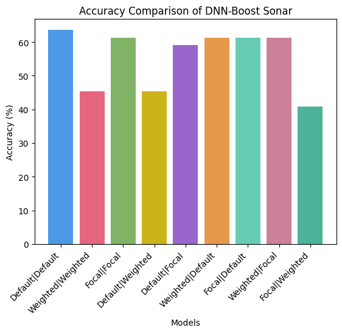

    - Pima Indians Diabetes

        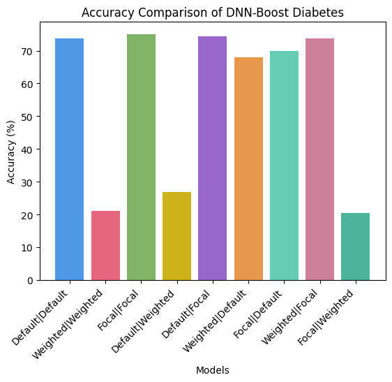

    - Parkinson

        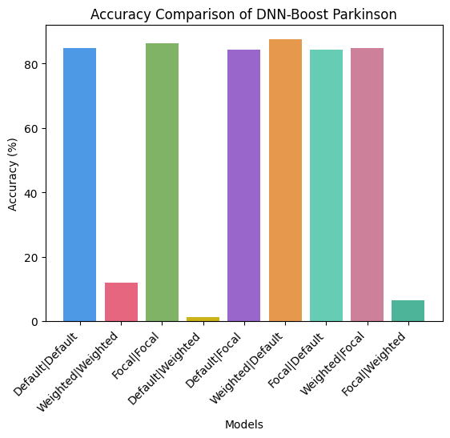

- **Analysis & Discussion**: 
Each bar in the charts above represent a specific DNN-Boost model with the x-axis as the specified parameters passed into the model for the custom loss functions. An example would be the second bar being labeled "Weighted|Weighted" means that the weighted custom loss function was passed into the DNN and then passed into the XGBoost model. The models with the highest accuracies throughout all the datasets are the DNN-Boost models with the parameters: Default|Default, Focal|Focal, Default|Focal, Weigthed|Default, Focal|Default, and Weighted|Focal. Out of all the models, the parameters that always underperformed were Weighted|Weighted, Default|Weighted, and Focal|Weighted. As seen priorly in the custom XGBoost models, the weighted loss function continuously underperformed compared to its counterparts. Since XGBoost is the second step in a two-step model, it is not surprising that we have low accuracies for the models that have a weighted loss function as their second parameter. 

In all prior experiments, the default or vanilla model has been the best performing model, in this case Default|Default, however given the DNN-Boost models with the second or XGBoost as the focal loss function outperformed the default model on the imbalanced datasets (Pima Diabetes and Parkinson’s). Even one of the models with the parameters Weighted|Focal outperformed the Default|Default model on the Heart Disease datasets and was extremely close in the Sonar Mines dataset. This might be the case because the output of the DNN when passed a weighted loss function, does not perform well. XGBoost performs well on weak learners. If the DNN output was classified as a weak learner or made weak learners from being passed into the XGBoost input, then it is plausible that we see the combination of Weighted|Focal do well in some cases. It is unsurprised since we see one of the top performing models have parameters as Weighted|Default. Since default can perform well no XGBoost, the boosting model can make up for the poor predictions made by the DNN with the passed in weighted loss function.


## 5. Bibliography
**[1]** Bentéjac C., Csörgő A., & Martínez-Muñoz G. (2021). A comparative analysis of gradient boosting algorithms. https://link.springer.com/article/10.1007/s10462-020-09896-5

**[2]** Li M., Fu X., & Li D. (2020). Diabetes Prediction Based on XGBoost Algorithm. https://iopscience.iop.org/article/10.1088/1757-899X/768/7/072093/pdf

**[3]** Wang C., Deng C., & Wang S. (2020). Imbalance-XGBoost: leveraging weighted and focal losses for binary label-imbalanced classification with XGBoost. https://github.com/jhwjhw0123/Imbalance-XGBoost. https://www.sciencedirect.com/science/article/pii/S0167865520302129?casa_token=1pqmPhixTewAAAAA:i9MEY__UA2l7P2WMejRHBnioCAdSf3uRohF-5sGnaeUv9LtvzG6B87DzLPB2ET9vECFrRAdNuA.

**[4]** Tianqi C. & Guestrin C. (2011). XGBoost: A Scalable Tree Boosting System. https://dl.acm.org/doi/pdf/10.1145/2939672.2939785

**[5]** Wang S., Liu W., Wu J., Cao L., Meng Q., & Kennedy P. (2016). Training Deep Neural Networks on Imbalanced Data Sets. http://203.170.84.89/~idawis33/DataScienceLab/publication/IJCNN15.wang.final.pdf

**[6]** dmlc XGBoost. Custmo Objective and Evaluation Metric. https://xgboost.readthedocs.io/en/stable/tutorials/custom_metric_obj.html.

**[7]** GeeksforGeeks. XGBoost. https://www.geeksforgeeks.org/xgboost/.

**[8]** Pedregosa, F., Varoquaux, Ga"el, Gramfort, A., Michel, V., Thirion, B., Grisel, O., … others. (2011). Scikit-learn: Machine learning in Python. Journal of Machine Learning Research, 12(Oct), 2825–2830.

**[9]** fedesoriano. (September 2021). Heart Failure Prediction Dataset. Retrieved [Date Retrieved] from https://www.kaggle.com/fedesoriano/heart-failure-prediction.

**[10]** Sejnowski,Terry and Gorman,R.. Connectionist Bench (Sonar, Mines vs. Rocks). UCI Machine Learning Repository. https://doi.org/10.24432/C5T01Q.

**[11]** Harris, C.R., Millman, K.J., van der Walt, S.J. et al. Array programming with NumPy. Nature 585, 357–362 (2020). DOI: 10.1038/s41586-020-2649-2.
